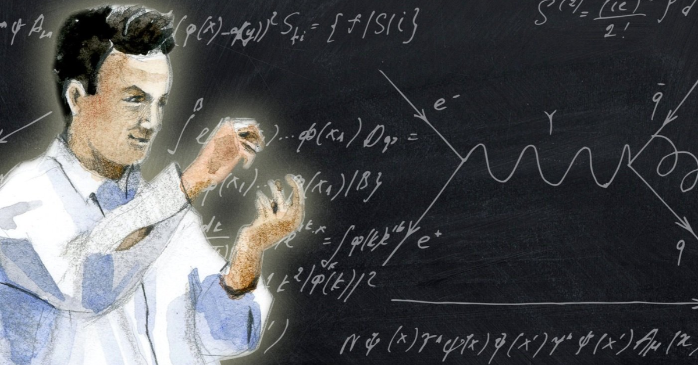

Hello and welcome to iiNotes. A place where you can find various lessons and guides from the Sciences, Philosophies, and Histories to even religious studies. This place is ever-growing, and new subjects are being added every day. If you would like to contribute to any subject/topic that you are interested in, please do so by creating a [pull request ](https://github.com/kazisean/iiNotes/pulls). If you see a mistake on any guide please . This is a open-source project and every guide is thanks to all the countless precious time our contributors have spent.

### Our Founding Philosophy 
> "If you can't explain it to a six year old, you don't understand it yourself." ― Albert Einstein

*Credit : Richard Feynman by rohanjolly*

Wishing you a happy learning!! We are currently working on building a Discord server where you can meet similar minded people who also love learning and teaching others. 
