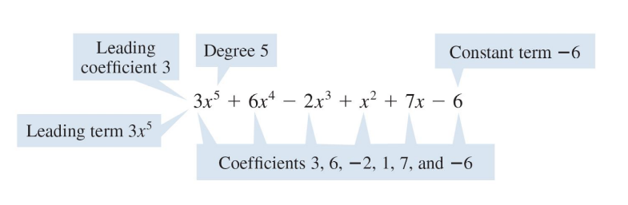
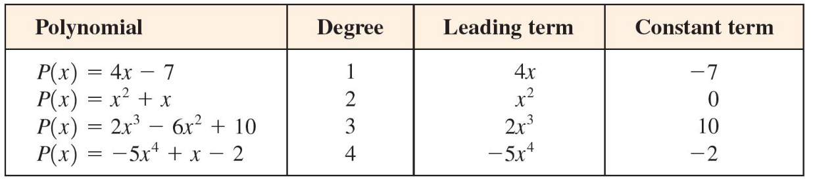
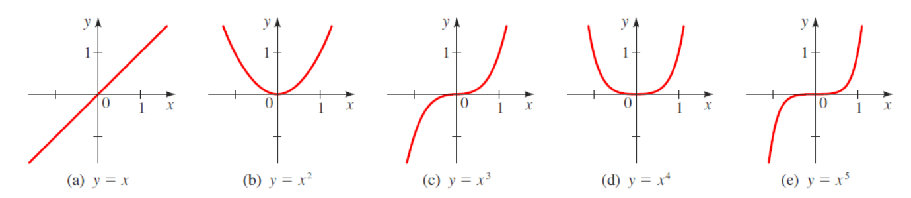

### Introduction : 

Polynomial functions are important in many areas of mathematics, science, and engineering, because they are relatively easy to work with and have many useful properties, such as continuity, differentiability, and the ability to approximate other functions. They can be used to model a wide range of phenomena, such as population growth, economic trends, physical processes, and many others.

For quick overview and revision purposes just watch this video : 
<iframe
    width="640"
    height="480"
    src="https://www.youtube.com/embed/a5x4lwnvHM0"
    frameborder="0"
    allow="autoplay; encrypted-media"
    allowfullscreen
>
</iframe>

Hello :)

### Polynomial Functions 

A polynomial function is a mathematical function of the form:

$f(x) = a_n x^n + a_{n-1} x^{n-1} + \cdots + a_2 x^2 + a_1 x + a_0$

where $x$ is the independent variable, and $a_n, a_{n-1}, \dots, a_2, a_1, a_0$ are coefficients, which can be real numbers, complex numbers, or other types of numbers, depending on the context of the problem. The degree of the polynomial is the highest power of the independent variable $x$ in the function. For example, the polynomial function $f(x) = 3x^4 - 2x^2 + x - 5$ is a polynomial of degree 4 because the highest power of $x$ in the function is 4.

Here is how we can read a polynomial function: 

Explanation : (Skip if you understand the picture)
+ The first variable is what called an *Leading Coefficient* which in this case is 3. The leading coefficient is always the first value of the polynomial. (Remember that if it was $x^2$ the leading coefficient would be 1.) 

+ The degree is the basically what ever the first term is raised to. So for example in this case the leading coefficient $3$ is attached to $x^3$ where it is raised to the power of 3.  

+ The leading term is basically the whole first term together. 

+ Coefficients are basically all the values that are attached to the variables. 

+ Constant terms is the number with no variable attached to it. 

#### Note : 
The degree of a polynomial is always a non-negative integer because it represents the highest power of the independent variable in the polynomial.

Here is an example of different polynomial equations with degree : 

#### Note : 
If polynomial consist of just a single term then it is called a ** monomial **. For example : $f(x) = -x^4$ and $p(x) = 5x^3$ are both considered monomials because they consist of only one term.  

### Graphing Basic Polynomial Functions

Before we start to learn how to graph more complex form of polynomials lets just start by graphing simple monomials. 

+ All the positive $x^2$ graph would go upward direction as shown is the picture of the graph b. Where $x^n$ and n is an even number the graph would always be similar. It would start at the origin and become flatter as the value of n increases. This can be seen in the graph (d) where $x^4$. If you compare the two graph (b) and (d) you would see what I am talking about. As the value of n increases the graph becomes flatter at the origin and as the value of n reaches nearing 0 the graph becomes more skinny and steep. 

+ We can see a similar trend in graph (c) and (e). Please remember that if n is raised to an odd number the graph would look similar to the graph (c). Like before as n nears zero the graph becomes less flat at the origin. Where as the value of n increases in an odd polynomial the graph becomes less flatter at the origin. Please also look at how the line reacts as the odd number n increases and decreases. For clear understanding compare graph (a) with graph (c) where graph a is raised to the power of 1 and graph c is raised to the power of 3 both of which are odd numbers.

+ Graph a is what known as a Linear polynomial function. (it crosses the origin) Notice that x raised to nothing means its raised to the power of 1. Which made the graph less flat at origin. 
+ Graph (b) is what known as a quadratic polynomial function. 
+ Graph (c) is what known as a cubic function

### Graphs of Polynomial Functions: End Behavior 

### Using Zeros to Graph Polynomials S

### Shape of the Graph Near a Zero

### Local Maxima and Minima of Polynomials
